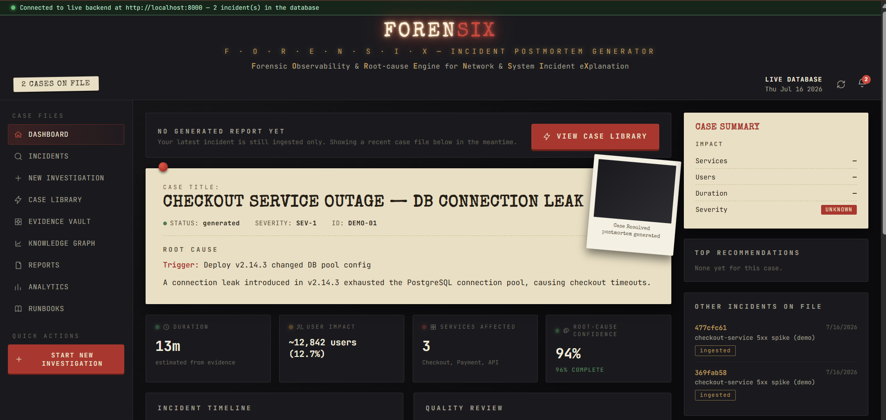
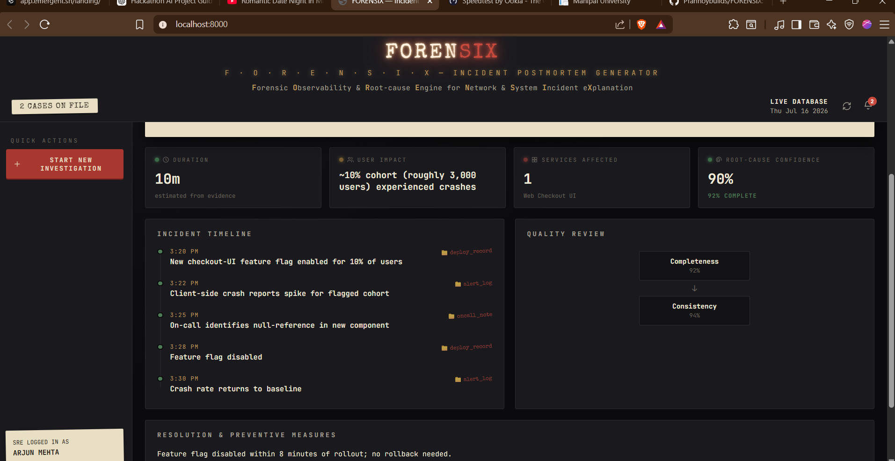

<div align="center">

# 🔍 FORENSIX

### Forensic Observability & Root-cause Engine for Network & System Incident eXplanation

*An AI-powered incident postmortem generator for SRE & AIOps teams*

<br/>


<br/>

[](https://python.org)
[](https://fastapi.tiangolo.com)
[](https://react.dev)
[](https://www.trychroma.com)
[](https://sqlite.org)

<br/>

**[📖 Documentation](#-getting-started)** &nbsp;•&nbsp;
**[🖥️ Screenshots](#️-screenshots)** &nbsp;•&nbsp;
**[⚙️ Architecture](#️-how-it-works)** &nbsp;•&nbsp;
**[🚀 Quickstart](#-getting-started)**

</div>

<br/>

---

## 📌 Overview

Most incident postmortems get written days late, from memory, missing half the timeline — or never get written at all.

**FORENSIX** ingests raw incident evidence (alert logs, deployment records, on-call notes, Slack threads) and runs it through a **5-agent AI pipeline** that reconstructs the full story: what happened, why, who was affected, and what to fix — with every claim traceable back to the source evidence.

<br/>

## 🖥️ Screenshots

<div align="center">

### Dashboard — Live Case Overview


<br/><br/>

### Case Report — Full Postmortem Detail


</div>

<br/>

## ⚙️ How It Works

Every incident report passes through five specialized agents, each with one narrow job:

<div align="center">

| # | Agent | Responsibility |
|:-:|:------|:----------------|
| 1️⃣ | 🕐 **Timeline Builder** | Reconstructs an evidence-based chronology — no guessing about order |
| 2️⃣ | 🎯 **Root Cause Investigator** | Separates trigger from underlying cause, with a confidence score |
| 3️⃣ | 📊 **Impact Analyzer** | Quantifies services, users, and duration affected |
| 4️⃣ | 🛠️ **Remediation Planner** | Produces owner-assignable next steps |
| 5️⃣ | ✅ **Quality Reviewer** | Checks every claim against evidence and scores the report |

</div>

The output is a full **case file**: timeline, root cause with confidence %, blast radius, and prioritized preventive measures — all backed by a per-incident RAG index over the original evidence.

<br/>

## ✨ Features

- 🗂️ **Case Library** — 8 fully worked example postmortems, ready to explore with zero setup
- 🔍 **Evidence-grounded reports** — every claim links back to its source artifact
- 📈 **Analytics dashboard** — severity trends, confidence scores, report activity heatmap
- 🎯 **Root-cause confidence scoring** — know how sure the system is, not just what it thinks happened
- 🕵️ **Noir case-file UI** — because incident reviews shouldn't look like a spreadsheet

<br/>

## 🧱 Tech Stack

<div align="center">

| Layer | Technology |
|:------|:-----------|
| **Backend** | FastAPI · SQLite · ChromaDB (per-incident retrieval) |
| **AI Pipeline** | LLM-powered 5-agent sequential pipeline |
| **Frontend** | Single-file React (CDN, zero build step) |
| **Styling** | Custom noir/case-file CSS theme |

</div>

<br/>

## 🚀 Getting Started

```bash
cd backend
python -m venv venv
venv\Scripts\activate        # Windows
pip install -r requirements.txt
uvicorn main:app --reload --port 8000
```

Then open **`http://localhost:8000`**.

> 💡 **No API key? No problem.** Head straight to **Case Library** in the sidebar for 8 fully worked example postmortems — DB connection leaks, DNS misconfigs, cache stampedes, TLS expiry, and more. Zero setup required.

<br/>

<div align="center">

[](http://localhost:8000)
[](#-how-it-works)

</div>

<br/>

## 🔑 Live Generation (Optional)

To generate a postmortem from **your own** incident evidence instead of the sample library, drop an API key into `backend/.env` and use **New Investigation**. This step is entirely optional — the app is fully explorable without it.

<br/>

## 📁 Project Structure

```
postmortem-generator/
├── backend/
│   ├── main.py            FastAPI routes + static frontend mount
│   ├── agents.py           5-agent pipeline
│   ├── rag.py               Per-incident RAG (chunking + ChromaDB)
│   ├── db.py                 SQLite persistence
│   └── sample_data/            Demo artifact files
├── frontend/
│   └── index.html          React dashboard (no build step)
└── docs/
    └── screenshots/          README images
```

<br/>

## 🗺️ Roadmap

- [ ] Real-time per-agent streaming via SSE
- [ ] Knowledge graph — auto-link incidents sharing a root cause
- [ ] Runbooks — turn recurring preventive measures into assignable playbooks

<br/>

## 👥 Team

**ByteBandits** — built for *[SYNERGY 2026]*, July 2026

<br/>

<div align="center">

**License:** TBD

<br/>

Made with 🔥 and too much coffee ☕

</div>
